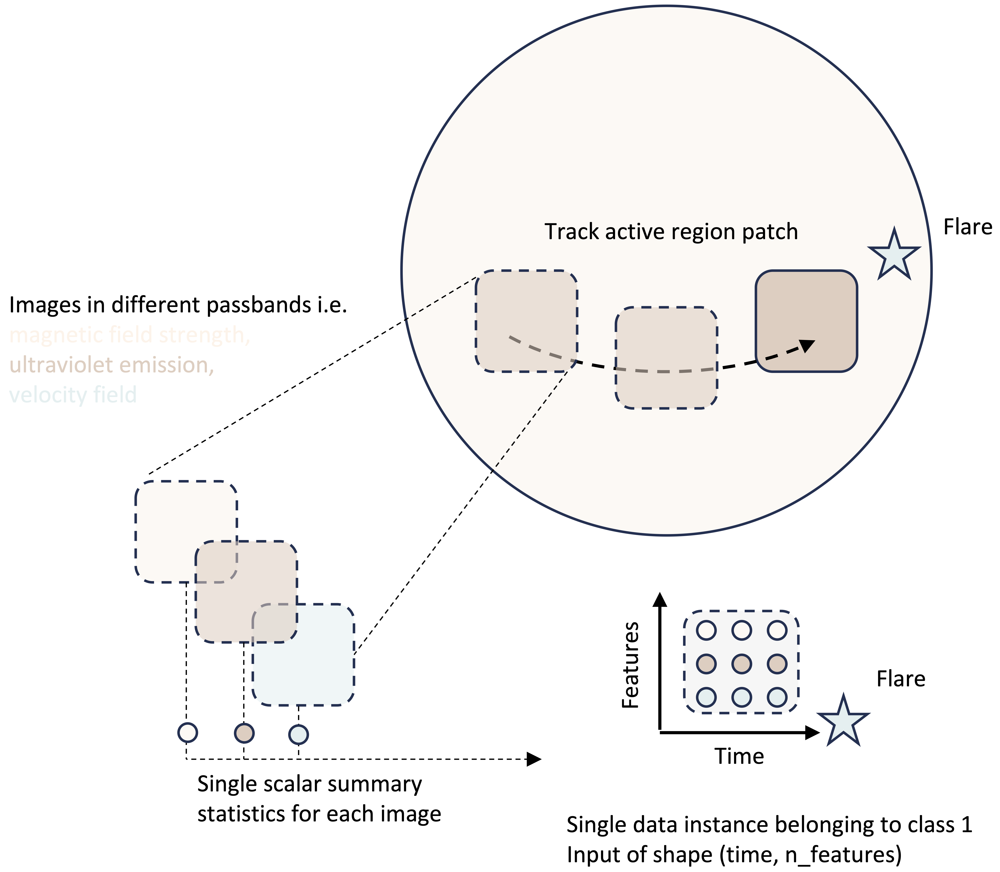
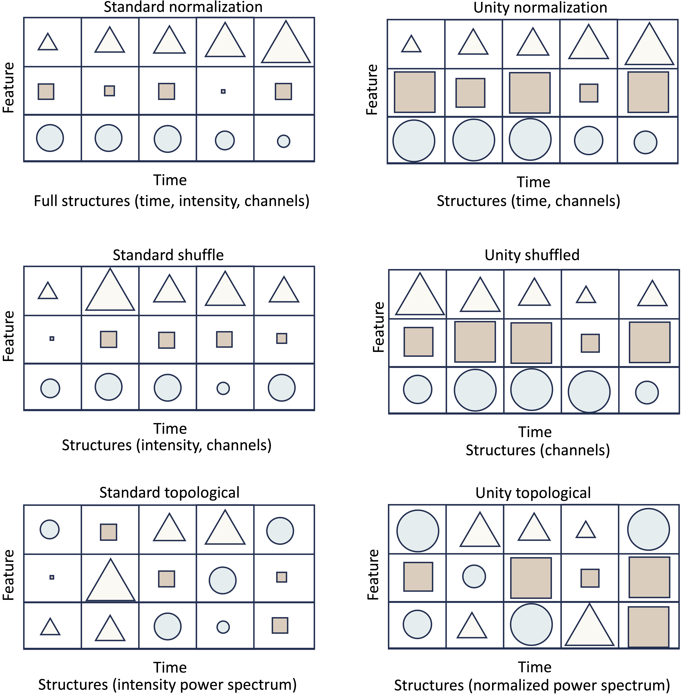
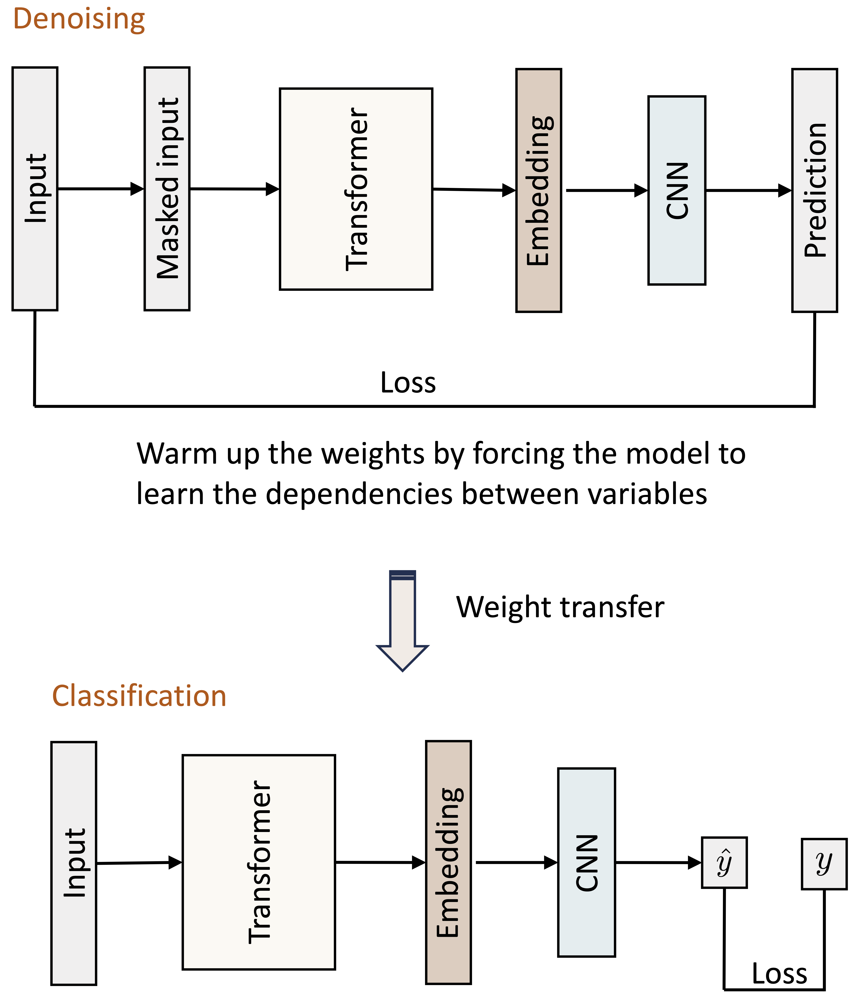
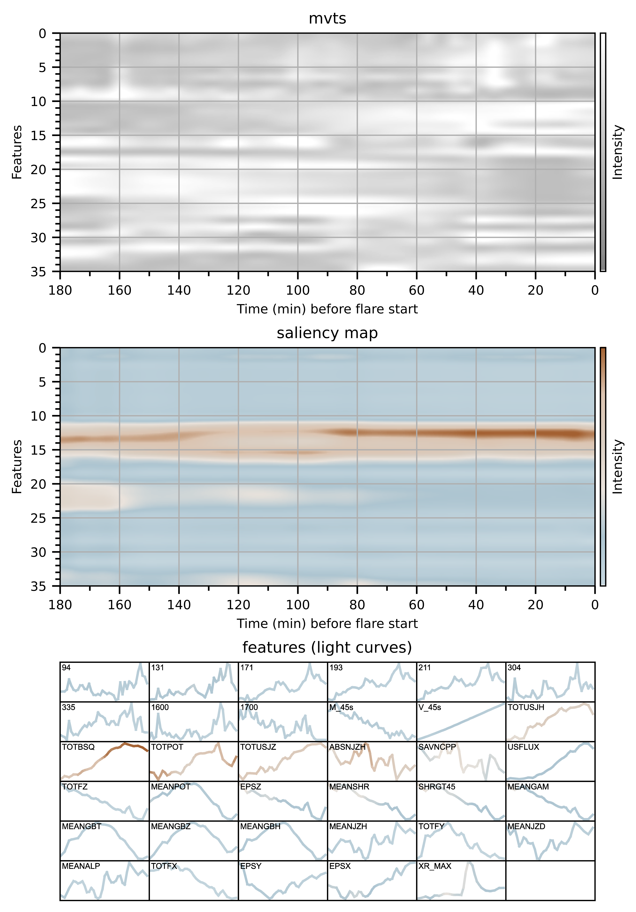

## Transformer-based sentiment analysis for flare prediction

In this repo, we use a hybrid state-of-the-art transformer model [(A. Vaswani)](https://arxiv.org/abs/1706.03762) to discover which structures in our multivariate time series (mvts) are important for flare prediction.
The following figure shows the data acquisition process. We use the header information in the SWAN-SF [(R. A. Angryk et al. 2020)](https://doi.org/10.7910/DVN/EBCFKM) benchmark dataset to derive the flare maximum time and active region bounding box information. We then step four hours back in time and collect multi-channel image data from the Joint Science Operations Center (JSOC). This image data includes magnetic field information from the Solar Dynamic Observatory’s [(SDO, Lemen et al. 2012)](https://ui.adsabs.harvard.edu/abs/2012SoPh..275...17L/abstract), Helioseismic and Magnetic Imager [(HMI, Scherrer et al. 2012)](https://ui.adsabs.harvard.edu/abs/2012SoPh..275..207S/abstract) instrument as well as full atmospheric coverage of multiple scale heights from the Atmospheric Imaging Assembly [(AIA, R. J. Lemen, 2012 ](https://ui.adsabs.harvard.edu/abs/2012SoPh..275...17L/abstract) instrument.   

  

Each image is converted into a single scalar summary statistic and concatenated into a tensor which becomes populated with spatiotemporal information as one moves forward in time toward flare onset. The resultant matrix is assigned a label $1$ if it terminates with a flare, and a label $0$ if it does not. Additionally, we append to the dataset a set of physical parameters inferred by magnetograms called Space-weather HMI Active Region Patches [(SHARPs, M.G. Bobra et al. 2014)](https://ui.adsabs.harvard.edu/abs/2014SoPh..289.3549B/abstract). Since a few data products have different cadences, all data are interpolated to a 12-minute cadence.   

To examine the relative importance of channel, time order, and intensity structure within the data, we devise a set of data augmentations that gradually relax these structures and reduce the amount of information in the input. We then evaluate the model on each new augmentation and monitor its performance. The set of augmentations can be seen in the following image:  

  

Each subplot is a different augmentation. The shapes represent different feature channels (such as magnetic field strength etc.) while the size of each shape represents the intensity of the feature at a particular time. The maximum structure is in the top left, while the minimum structure is in the bottom right, where the model can only leverage the relative power spectrum of the input.  

The dataset consists of roughly 250 positive and $250$ negative samples. In such a data-sparse domain, it is advisable to first warm up the model wights using an autoregressive denoising technique as seen below:

  

In unsupervised denoising mode, the transformer learns to correctly fill in a masked version of the input, thus learning the correlations between the different channels. The resulting weights are now more optimally positioned on the loss landscape ("warmed up") and therefore requires fewer instances during the supervised task (classification mode) to converge.   

Additionally, because of the sparsity of the dataset, it is important to eliminate random chance and increase the result’s robustness by performing kfold cross-validation, i.e., aggregating over results from different random splittings of the dataset into test and train sets. In our case, we simply generate 50 random splittings and aggregate all 50 model results. 

Since our model is composed of a transformer, CNN hybrid, we can also use Guided Grad-CAM [(R. R. Selvaraju et al. 2016)](https://arxiv.org/abs/1610.02391) to retrieve saliency maps of the input which highlight the particular instances of the discriminant region, i.e., a visual explanation for what the model focused on for its classification decision. It is important to note that Grad-CAM after the transformer embedding is difficult to interpret over the original feature space. We use Grad-CAM as a novel way to rank order the input features.  

**Code**    

- `src/`
  - `config.py`: high-level instructions for scripts (controls the number of epochs plus type of augmentation, base (standard, unity) and active norm)
  - `datasets.py`: script for loading data for denoising and classification tasks
  - `losses.py`: contains loss functions for denoising and classification tasks
  - `normalizations.py`: all augmentations for relaxing the structure of the input
  - `kfold/`
    - `kfold_cnn.py`: trains the CNN classifier over all 50 folds and saves the best model for each split
    - `kfold_combined.py`: trains the transformer-CNN hybrid classifier over all 50 folds and saves the best model for each split
    - `kfold_grad_cam.py`: calculates attribution masks for each instance as aggregates over all 50 models
  - `plotting/`
    - `plot_x_x_masked.ipynb`: plots a random example of input and masked input as seen in the paper
    - `plot_tree_maps.ipynb`: plots structure contributions in terms of TSS (relative square size)
    - `plot_grad_cam.ipynb`: plots a single example of aggregated Guided Grad-CAM over all 50 models as seen in the paper
    - `plot_feature_ranking.ipynb`: box plot for feature ranking via saliency maps as shown in the paper  
- `running_metrics.py`: collects metrics from all 50 folds for each type of data augmentation and saves to a CSV file  

  

<!-- project  
|
|-- src/
    |
    |-- config.py (high-level instructions for scripts)
    |-- datasets.py (script for loading data for denoising and classification tasks)
    |-- losses.py (contains loss functions for denoising and classification tasks)
    |-- normalizations.py (all augmentations for relaxing the structure of the input)
    |
    |-- kfold/
        |
        |-- kfold_cnn.py (trains the cnn classifier over all 50 folds and saves the best model for each split)
        |-- kfold_combined.py (trains the transformer cnn hybrid classifier over all 50 folds and saves the best model for each split)
        |-- kfold_grad_cam.py (calculates attribution masks for each instance as aggregates over all 50 models)
    |
    |--plotting/
        |
        |-- plot_x_x_masked.ipynb (plots a random example of input and masked input as seen in the paper)
        |-- plot_tree_maps.ipynb (plots structure contributions in terms of TSS (relative square size))
        |-- plot_grad_cam.ipynb (plots a single example of aggregated Guided Grad-CAM over all 50 models as seen in the paper)
        |-- plot_feature_ranking.ipynb (box plot for feature ranking vis saliency maps as shown in the paper)
 -->
