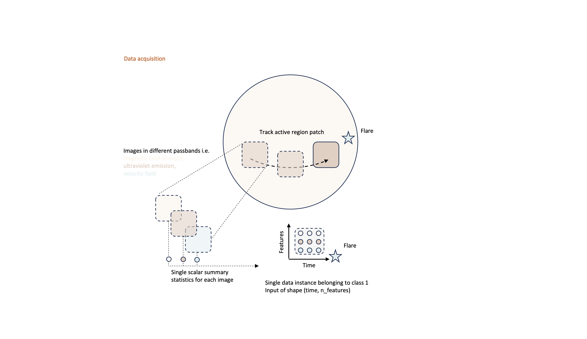
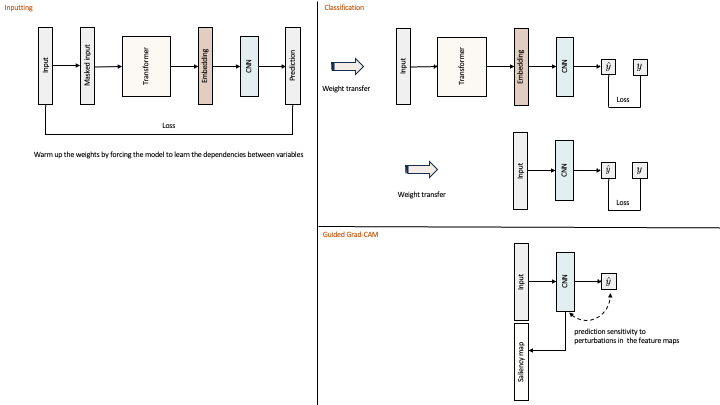
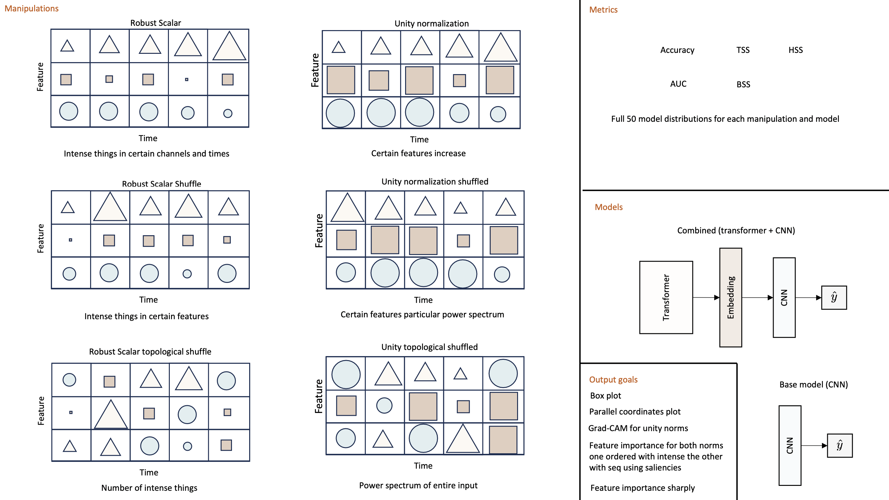

## Transformer-based sentiment analysis for flare prediction

In this repo, we use a hybrid state-of-the-art transformer model to predict solar flares.
Each data instance is an $(m \times n)$ matrix composed of a collection of light curves taken from the Solar Dynamics Observatory (SDO).
The dataset is bootstrapped from the [SWAN-SF](https://doi.org/10.7910/DVN/EBCFKM), making use of two pieces of header information, 1) A rough estimate of the flare maximum, and 2) The coordinates of the bounding box that isolates the active region patch. This information is then used to generate light curves at high cadence by taking summary statistics from images in different passbands (both AIA and HMI) as the active region is tracked resulting in a single data instance of shape (time, n_features). Each instance is then assigned a class label $\{1,0\}$ depending if it leads to a flare or not. The light curves and integrated X-ray flux from the GOES satellite are then monitored such that the positive flare case spans a total of four hours and stops before the flares inpulsive phase. The entire dataset only consists out of $~250$ instances for each class, making this a data-sparse problem. 

The idea is to gradually loosen the structure in the data and monitor how this affects the prediction capacity.  

<!--  -->

